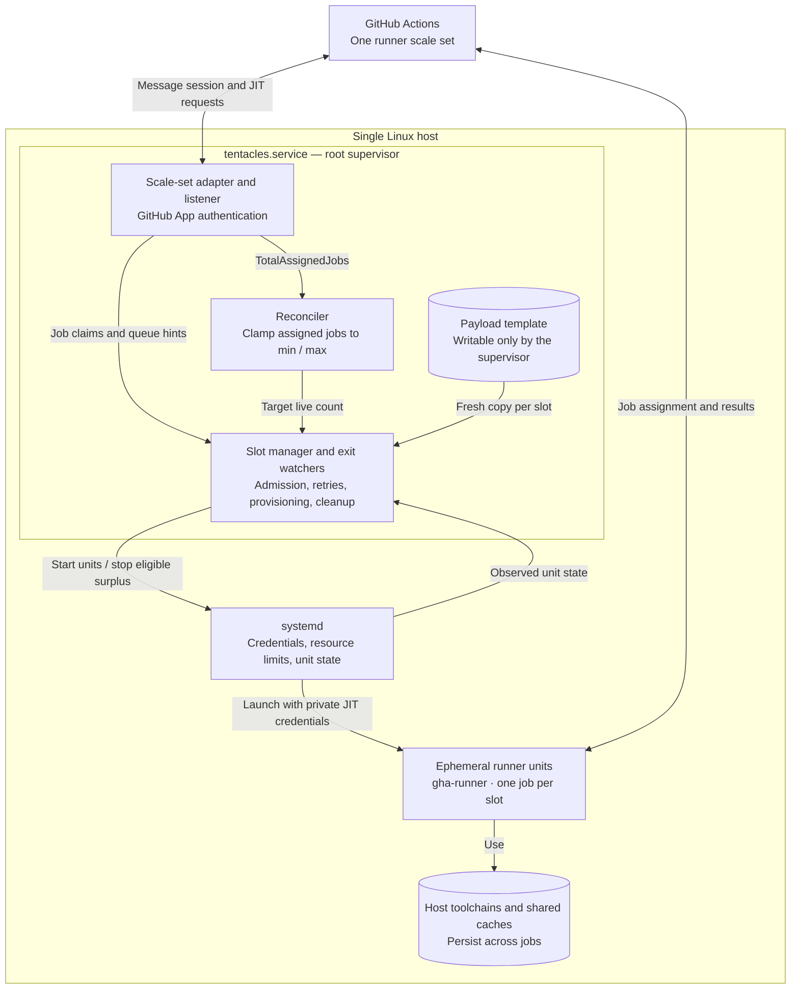
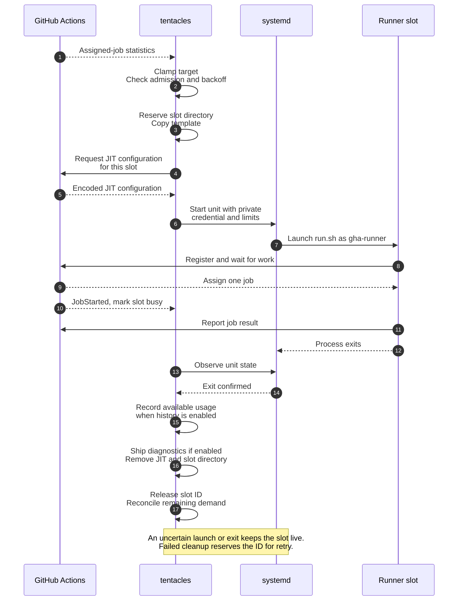

# tentacles

`tentacles` is a single-host supervisor for GitHub Actions runners. It
authenticates as a GitHub App, owns one runner scale set through
[`github.com/actions/scaleset`](https://github.com/actions/scaleset), and
starts official [`actions/runner`](https://github.com/actions/runner)
processes with just-in-time (JIT) configuration. Every process is a
one-job slot: after confirmed process exit, the daemon removes the slot
directory, its work folder, and JIT files. Failed cleanup retains the slot
ID for retry; each new slot starts from a fresh copy of the payload.

No Docker, no microVMs, no Kubernetes, no `config.sh`, no `svc.sh`, no
inbound webhooks.

Contents:

1. [Security warning](#security-warning)
2. [How it works](#how-it-works)
3. [Quickstart](#quickstart)
4. [Configuration](#configuration)
5. [Scaling semantics](#scaling-semantics)
6. [Payload and slot lifecycle](#payload-and-slot-lifecycle)
7. [Observability](#observability)
8. [systemd integration](#systemd-integration)
9. [Failure modes and troubleshooting](#failure-modes-and-troubleshooting)
10. [Upgrades](#upgrades)
11. [Development](#development)
12. [Known limitations](#known-limitations)
13. [Acceptance criteria](#acceptance-criteria)

## Security warning

> **This is not job isolation.** Jobs run as the `gha-runner` Unix user
> directly on the host, with host toolchains, caches, and network.
> Anyone who can queue a workflow targeting the scale set can run code
> on this machine. The control that matters lives in GitHub, not in this
> daemon: restrict the runner group to selected repositories, and only
> install the App on orgs you trust.

If you cannot accept that model, this project is not the right tool. Use
container- or VM-isolated runners instead.

## How it works

The production backend separates the root supervisor from the unprivileged
runner units. GitHub supplies demand and assigns jobs; the daemon manages
local capacity and each runner's lifetime.



The runner units remain independent of `tentacles.service`, so a supervisor
restart can adopt surviving jobs. Each slot gets its own work directory;
jobs still share the runner UID, host toolchains, and caches.

- The scale-set listener (the upstream `listener` package) long-polls the
  message API. `statistics.TotalAssignedJobs` supplies the desired count.
  Job lifecycle messages track claims and completions without incrementing
  or decrementing that target.
- A reconciler targets `clamp(TotalAssignedJobs, min_runners, max_runners)`
  official runner processes, one slot per process. Admission holds and
  start failures can leave actual below desired; busy runners can keep it
  above desired until they exit.
- A slot is a `systemd-run` transient unit named `tentacle-<id>.service`
  running as the configured unprivileged user. The root supervisor writes
  a `0600` JIT source under its private runtime directory; systemd
  `LoadCredential` delivers a private copy to the job unit. The shell reads
  that copy and supplies `--jitconfig` to the official runner. The value
  remains visible in process arguments for the lifetime of `run.sh`; keep
  this host restricted to trusted workloads and administrators.
- Workflows target the scale-set name, not `self-hosted`:

  ```yaml
  jobs:
    test:
      runs-on: debian-host
  ```

Slot lifecycle states are `starting` (provisioning), `idle` (launch completed,
no JobStarted seen), `busy` (claimed, adopted, or launch outcome uncertain),
and `stopping` (stop or cleanup pending). Only `starting`, `idle`, and
`busy` count toward the live runner count, including during provisioning.
The metrics schema also includes `empty` and `failed`; failed starts are
cleaned up or retained conservatively rather than kept in `failed`.

## Quickstart

### 1. GitHub App

1. Create a GitHub App (org or repo scope). Record the client id and
   installation id; save the private key PEM.
2. Grant the scale-set permission with **Read and write** access:
   - Organization scale set: organization **Self-hosted runners**
     (`organization_self_hosted_runners`)
   - Repository scale set: repository **Administration** (`administration`),
     with **Metadata: Read-only**

   See GitHub's [App permission requirements](https://docs.github.com/en/actions/how-tos/manage-runners/use-actions-runner-controller/authenticate-to-the-api#authenticating-arc-with-a-github-app).
3. Install the App on the org (or repo) that owns the scale set.
4. For an organization scale set, restrict the runner group to selected
   repositories only. For repository scope, use a trusted repository.

### 2. Host bootstrap (one-time, as root)

The default production payload requires Linux x86-64. The systemd backend
requires systemd 254+; startup checks this before downloading a payload.
Debian 13 and Ubuntu 24.04 meet that systemd requirement.

```sh
sudo ./scripts/install-host-deps.sh
```

The script installs `libicu` with distro detection, `libkrb5-3`, `zlib1g`,
`curl`, `ca-certificates`, `jq`, and `git`. It is idempotent but covers only
part of the runner's dependencies. The pinned release's
[official dependency installer](https://github.com/actions/runner/blob/v2.337.0/src/Misc/layoutbin/installdependencies.sh)
also handles SSL and LTTng packages; run it from the verified payload
before the first job, as shown below.

The supported production deployment uses the hardened **root supervisor**
unit and an unprivileged `gha-runner` account. The daemon needs system-unit
control, private credential delivery, and ownership transfer of fresh
slots. The runner account gets no sudo or Docker socket access.

```sh
sudo useradd --create-home --shell /bin/bash gha-runner  # once, if absent
sudo install -d -o root -g root -m 0755 /etc/tentacles /var/lib/tentacles /var/cache/tentacles
sudo install -d -o root -g root -m 0750 /var/log/tentacles
sudo install -d -o root -g root -m 0700 /run/tentacles
sudo -u gha-runner mkdir -p /home/gha-runner/.cache /home/gha-runner/.local/share/mise /home/gha-runner/go/pkg/mod
```

`StateDirectory`, `CacheDirectory`, `LogsDirectory`, and `RuntimeDirectory`
in the service recreate their paths at boot. The runtime directory stays
private and survives daemon restarts. The payload template and daemon
configuration must remain root-owned. Existing installations must change
only the **top-level** state/cache directory owners before adopting the
root service; recursively changing ownership would damage active jobs.
Stop other supervisors before migration, preserve active slot descendants,
and follow the [canary checklist](docs/production-readiness.md).

Install mise and the required toolchains as `gha-runner`, and put the
shims on `PATH` in `/etc/tentacles/runner.env`. Jobs do not source `.bashrc`.
If the runner HOME or any daemon path changes, update the service's
writable paths to match. Run the official payload's
`bin/installdependencies.sh` when a runner release changes its dependencies.

### 3. Build and configure

Go 1.26.8 or a newer supported patch release (see `go.mod`):

```sh
go build -ldflags "-X github.com/0xinterface/tentacles/internal/version.Version=v1.0.0" \
    -o tentacles ./cmd/tentacles
sudo install -m 0755 tentacles /usr/local/sbin/tentacles
sudo install -m 0600 app.pem /etc/tentacles/app.pem
sudo install -m 0644 configs/config.example.yaml /etc/tentacles/config.yaml
sudo install -m 0644 configs/runner.env.example /etc/tentacles/runner.env
# edit config: App credentials, scope, capacity, absolute production paths,
# runner environment_file=/etc/tentacles/runner.env, runtime.backend=systemd
```

The example uses development paths and a throwaway key. Set these fields
in the installed config to match the shipped production service, alongside
your real App credentials and scope:

| Field | Production value |
|---|---|
| `github.app.private_key_path` | `/etc/tentacles/app.pem` |
| `runner.environment_file` | `/etc/tentacles/runner.env` |
| `paths.state_dir` | `/var/lib/tentacles` |
| `paths.cache_dir` | `/var/cache/tentacles` |
| `paths.log_dir` | `/var/log/tentacles` |
| `runtime.backend` | `systemd` |
| `runtime.jit_dir` | `/run/tentacles` (default) |

Keep `capacity.min_runners: 0` during bootstrap and wait to queue workflows
until dependencies are installed. Validate the configuration:

```sh
sudo tentacles --config /etc/tentacles/config.yaml --dry-run
```

Exit 0 means configuration validation passed; it does not verify App
authentication, payload availability, directory writability, or the full
systemd prerequisites. See [validation scope](#validation-scope).

### 4. Enable the service

```sh
sudo install -m 0644 configs/systemd/tentacles.service /etc/systemd/system/
sudo systemctl daemon-reload
sudo systemctl enable --now tentacles
```

The unit is `Type=notify`; systemd considers it started only after the
listener session exists, so a broken App or network fails loudly instead
of reporting a healthy daemon.

Once startup has prepared the verified payload, complete the host
dependencies before queuing the first job:

```sh
sudo /var/lib/tentacles/template/bin/installdependencies.sh
```

Confirm the scale set appears under the organization or repository's
Settings, Actions, Runners, matching your configured scope.
Then move one repository to `runs-on: debian-host` while any existing
standing runner is still up. Retire the old `svc.sh` unit only after the
first real job passes. Never run two agents against the same work
directory.

## Configuration

The binary takes three flags:

| Flag | Meaning |
|---|---|
| `--config <path>` | config file, default `/etc/tentacles/config.yaml` |
| `--dry-run` | load and validate the config; exit 0 on success, nonzero on error |
| `--version` | print the build version |

### Fields and defaults

Omitted fields fall back to these defaults. The decoder is
strict: an unknown key is a startup error, not a silent no-op.

| Field | Default | Notes |
|---|---|---|
| `github.url` | `https://github.com` | GHES roots work; scope is appended |
| `github.app.client_id` | required | |
| `github.app.installation_id` | required, `> 0` | |
| `github.app.private_key_path` | required | PEM file, read at startup |
| `github.scope.kind` | required | `organization` or `repository` |
| `github.scope.owner` | required | |
| `github.scope.repository` | required when kind is `repository` | |
| `scale_set.name` | required | valid Actions label; this is `runs-on` |
| `scale_set.runner_group` | `Default` | custom group names are resolved through GitHub at startup |
| `scale_set.extra_labels` | `[]` | applied at scale-set creation |
| `capacity.min_runners` | `0` | floor on total desired runners; subject to admission and start failures |
| `capacity.max_runners` | required | target ceiling; compiled limit 32; existing busy jobs are preserved |
| `capacity.job_cpu_quota_percent` | required | systemd `CPUQuota`, e.g. 400 |
| `capacity.job_memory_max` | required | systemd `MemoryMax`, e.g. `8G` |
| `runner.version` | unset | `X.Y.Z` pins the payload; unset tracks the latest release |
| `runner.download_url` | official release URL | override for mirrors |
| `runner.sha256` | unset (required when `version` is pinned) | unless `TENTACLES_ALLOW_UNVERIFIED_PAYLOAD=1` |
| `runner.work_directory` | `_work` | JIT work folder inside the slot |
| `runner.disable_update` | `true` | runner self-update off at scale-set creation |
| `runner.user` | `gha-runner` | |
| `runner.group` | account primary group | |
| `runner.environment_file` | required | systemd EnvironmentFile path |
| `paths.state_dir` | `/var/lib/tentacles` | slots + template live here |
| `paths.cache_dir` | `/var/cache/tentacles` | payload tarball cache |
| `paths.log_dir` | `/var/log/tentacles` | shipped `_diag` archives |
| `runtime.backend` | `systemd` | `process` for dev hosts without systemd |
| `runtime.slot_start_timeout` | `90s` | bounds copy, JIT mint, and backend start |
| `runtime.slot_stop_timeout` | `30s` | bounds each stop (also `TimeoutStopSec`) |
| `runtime.cleanup_timeout` | `60s` | bounds diagnostics and wipe; retains ID until worker finishes |
| `runtime.acquire_grace` | `3m` | see [Scaling semantics](#scaling-semantics) |
| `runtime.jit_dir` | `/run/tentacles` | tmpfs in production |
| `observability.listen` | `127.0.0.1:9090` | metrics + `/healthz` |
| `observability.log_level` | `info` | `debug`, `warn`, `error` also accepted |
| `observability.ship_diag` | `true` | copy `_diag` before wipe |
| `observability.diag_max_age` | `168h` | completed archive retention |
| `observability.diag_max_bytes` | `1073741824` | completed archive byte budget |
| `scaling.admission_control` | `true` | history-based admission gate |
| `scaling.cpu_target_percent` | `90` | share of host cores reserved by live runners |
| `scaling.memory_margin_percent` | `20` | share of MemAvailable kept free |
| `scaling.sample_interval` | `30s` | usage sampling period |

### Validation scope

After strict YAML decoding, configuration validation collects errors for
capacity bounds, required credentials and scope fields, scale-set name
syntax, payload pin/digest rules, paths, timeouts, and observability/scaling
settings. It checks that the key path exists, parses the environment file
and requires non-empty `PATH` and `HOME`, and checks for
`/run/systemd/system` when the systemd backend is selected.

`--dry-run` stops there. Normal startup also creates and probes writable
daemon directories, resolves the runner identity, prepares the payload, and
reads the private key to initialize the GitHub client. For the systemd
backend, it enforces a root supervisor, a non-root runner, and systemd 254+.
App authentication and session readiness require a real startup with
network access.

Configuration is loaded once; restart after edits. Existing scale sets
are reused without updating their labels or `disable_update` setting, so
changing those fields alone does not modify an existing scale set.

### runner.env

`runner.env` is a systemd `EnvironmentFile`, not YAML:

```dotenv
PATH=/home/gha-runner/.local/share/mise/shims:/usr/local/bin:/usr/bin:/bin
HOME=/home/gha-runner
MISE_DATA_DIR=/home/gha-runner/.local/share/mise
LANG=C.UTF-8
```

The daemon parses it at startup and refuses to run jobs if `PATH` or
`HOME` is missing. This is the fix for the classic "systemd does not see
mise/node" failure mode. Jobs are not login shells; if a tool
only works after `eval "$(mise activate bash)"`, fix this file instead.

## Scaling semantics

- Desired = `statistics.TotalAssignedJobs`, then
  `desired = clamp(desired, min_runners, max_runners)`. Before the first
  statistics message, desired starts at `min_runners`. Cancellation and
  reassignment messages do not directly adjust desired.
- `min_runners: 1` targets one total runner, which can wait idle when
  there are no jobs. A busy runner satisfies that floor; it does not add
  an extra idle runner. Admission holds and start failures can delay
  reaching the floor. With the default `0`, no outstanding jobs, and
  successful stop/exit observation and cleanup, the daemon scales to zero
  processes and slot directories.
- Starts are sequential in v1. A slot being provisioned counts toward
  actual, so reconcile cannot overshoot the cap.
- Scale-down stops the oldest eligible slots: `idle`, or `starting` once
  they pass the acquire grace. Busy slots are never stopped, no matter
  how far desired drops.
- Reconcile runs at boot, on desired-count messages, normal slot exits or
  stops, a 30-second safety tick, and acquisition retry timers. Failed
  provisioning is retried with backoff without waiting for GitHub.
- **Admission control** (on by default): systemd accounting is sampled
  every `scaling.sample_interval` (default 30s). At a claimed slot's exit,
  the latest samples and elapsed time feed per-workflow moving averages in
  `state_dir/history.jsonl`. CPU and peak-memory records can miss usage
  after the last sample; short jobs may have no resource sample at all.
  Before starting a slot the gate predicts the cost of all starting,
  idle, and busy runners plus the incoming one. If that exceeds the CPU
  target share of host cores or available-memory budget, the start is
  held and retried on a later reconciliation. Queued jobs are identified
  from `JobAvailable` messages, so the prediction
  reserves the largest queued estimate in each dimension when available.
  Queue hints expire after ten minutes and are bounded to 1,024 refs.
  Each unclaimed slot retains its provisioning estimate; the gate charges
  the larger of that estimate and the current queued estimate. Memory is
  charged as predicted growth above sampled current usage, because
  `MemAvailable` already excludes resident pages. The gate stays inert
  without usable sampled history and always admits a first runner when
  no runners are live. The process
  backend produces no new resource samples, but can use previously stored
  history. If history cannot be opened, admission control is disabled;
  if `MemAvailable` cannot be read, the memory check is skipped. These are
  estimates, with per-runner hard limits supplied separately by systemd's
  `CPUQuota` and `MemoryMax`.
- Exit classification: a runner that exits before any
  JobStarted and inside the acquire grace is an acquire failure
  (metric + event, cleanup scheduled). A runner that exits after a job is a
  plain exit. An idle warm-pool runner is never torn down for being
  idle; only a surplus decision from reconcile stops it.
- Acquisition failures use a one-second exponential backoff capped at
  thirty seconds. Desired-count pushes respect that hold; failures cannot
  immediately requeue themselves into an API/log storm. Natural failures
  are also retried by the thirty-second safety tick.
- The listener restarts with 1s, 2s, 5s, 15s, 30s backoff on failure.
  Existing runners keep working during a reconnect.

## Payload and slot lifecycle

At daemon startup, the version comes from one of two modes. Version and
digest changes take effect after a restart:

- **Pinned** (recommended for production): `runner.version` plus
  `runner.sha256` are set. Newly materialized payloads must match that
  digest. The development escape `TENTACLES_ALLOW_UNVERIFIED_PAYLOAD=1`
  permits an omitted digest; a supplied digest is still verified.
- **Tracking** (`runner.version` unset): the daemon queries the GitHub
  releases API for the latest `actions/runner` release, reads the
  version from the tag and the sha256 from the release asset's digest,
  and verifies the download against it. This still fails closed: if the
  API is unreachable or the release carries no digest, startup fails
  and tells you to pin the version instead. Each tracking startup makes a
  release-resolution request even when the template is cached. These
  unauthenticated requests share GitHub's
  [60-request hourly limit per IP](https://docs.github.com/en/rest/using-the-rest-api/rate-limits-for-the-rest-api#primary-rate-limit-for-unauthenticated-users).
  Pinning avoids that lookup; scale-set authentication and listening still
  require GitHub connectivity.

Then, in both modes:

1. Reuse the existing template if its version+sha marker matches. This
   skips downloading, hashing, and extraction; it does not revalidate the
   installed tree's contents. Keep the template writable only by root.
2. Otherwise, download `actions-runner-linux-x64-<ver>.tar.gz` into
   `paths.cache_dir` if not cached. Downloads are capped at 1 GiB.
3. Verify the configured or resolved sha256. A mismatch triggers one
   redownload, then a hard failure; the daemon refuses to start any slot.
4. Extract into `template.tmp`, sync files and the marker, then promote it
   to `paths.state_dir/template`. Replacement moves the old tree aside
   before renaming staging into place; it attempts rollback on cancellation
   or promotion failure. This is a two-rename replacement with a brief gap,
   not an atomic directory exchange. A crash can leave staging or a
   `template.previous-*` backup for operator inspection.
5. Never run `config.sh` on the template.

The sequence below shows a typical successful job. Admission or acquisition
backoff can defer provisioning before any new runner starts; GitHub
notifications and process-exit observations arrive asynchronously.



The exit watcher observes units throughout their lifetime. A `JobCompleted`
message alone never permits deleting a slot; cleanup requires confirmed
process exit. Resource history uses periodic samples, as described in
[Scaling semantics](#scaling-semantics).

The filesystem operations for each slot are:

1. Exclusively create `paths.state_dir/slots/<id>` and copy the template's
   files, modes, and symlinks into it. Pre-existing slot directories are
   not reused for new launches.
2. Mint a JIT config named `<scale-set>-<id>-<rand>` with the work
   folder set from `runner.work_directory` inside the slot (default
   `_work`), write it `0600` to `jit_dir`, and start the unit.
3. On confirmed exit: copy `_diag` to a unique private archive under
   `log_dir` including slot and runner identity (if `ship_diag`), unlink
   `.runner`/`.credentials` files without following links, unlink the JIT
   file, and delete the slot directory. Cleanup failures retain the ID
   for retry. The next slot re-copies the template.

Before starting a slot the daemon checks the state filesystem: under 10%
free it refuses new slots, records an acquisition failure, and retries
with backoff. The listener stays up; its configured maximum capacity is
not reduced to reflect the local disk or admission hold.

## Observability

Logs are structured JSON via `log/slog` on stderr, so journald picks
them up: `journalctl -u tentacles -o cat` shows the application's JSON;
`-o json` adds journald's JSON envelope. Depending on the message, fields
include `scale_set`, `slot`, `runner_name`, `desired`, and `err`.
Some components nest fields under their logger group. The JIT
payload, the PEM, and installation tokens are never logged.

The metrics listener (default `127.0.0.1:9090`) serves Prometheus text
format plus a liveness endpoint at `/healthz`. That endpoint returns 200
once the HTTP server is listening, including before GitHub session
readiness and during reconnects; use the service's initial `READY=1`
notification and listener-error metrics to assess startup and connectivity.

| Metric | Meaning |
|---|---|
| `tentacles_desired_runners` | last reconciliation target; refreshed once per second |
| `tentacles_actual_runners{state=}` | slots per state (`starting`, `idle`, `busy`, `stopping`, `failed`, `empty`) |
| `tentacles_jobs_started_total` | JobStarted messages matched to a slot (claims) |
| `tentacles_jobs_completed_total{result=}` | claimed slot exits; `result` is the JobCompleted message's value, `unknown` when that message was missed |
| `tentacles_acquire_failures_total` | failed/uncertain starts + never-claimed exits within acquire grace |
| `tentacles_slot_start_seconds` | histogram of full provision time for successful starts |
| `tentacles_listener_errors_total` | failed listener runs, counted once per failure |
| `tentacles_last_message_id` | last scale-set message ID processed |
| `tentacles_job_cpu_seconds` / `tentacles_job_wall_seconds` | sampled CPU / elapsed time for completed claimed slots; see collection conditions below |
| `tentacles_last_job_peak_memory_bytes` | most recent nonzero completed-job memory sample |
| `tentacles_admission_holds_total` | starts held by the admission gate |

Job CPU and peak memory depend on successful systemd samples; wall time
runs from the observed claim to slot exit. `jobs_started_total` counts
claims matched to a slot, and `jobs_completed_total` counts claimed slot
exits, so neither counter drops jobs when the listener reconnects; the
completion message's result labels the exit, or `unknown` if it never
arrived. Listener failures are counted once per failed listener run.

`_diag` shipping is on by default. Disabling it loses those files when
the slot is removed, although runner stdout/stderr may remain in the job
unit's journal. Archives are private and limited to 64 MiB, 4,096 entries,
and 64 directory levels. Symlinks, hardlinks, FIFOs, sockets, and devices
are skipped; ordinary errors or cancellation discard partial copies.
Shipping stops before free space falls below the larger of 256 MiB and
10% of the log filesystem.

Age and byte retention run before and after shipping, with defaults of
seven days and 1 GiB. There is no periodic pruning when shipping is idle
or disabled. Only recognized, marked completed archives are pruned;
legacy archives and staging left by a crash need operator cleanup, as
described in [production readiness](docs/production-readiness.md).
Ordinary diagnostic errors are logged and allow slot removal to continue.
If the overall cleanup deadline expires, the slot remains reserved until
the worker finishes, with failed cleanup retried later.

## systemd integration

- The daemon unit is `Type=notify`. `READY=1` goes out only after: config
  validated, payload prepared or matching template reused, GitHub client
  created, scale set ensured, boot adoption done, and the listener session
  created. If the session never comes up, the daemon never
  reports ready; systemd restarts it until the network or credentials
  are fixed.
- Slot units are transient: the daemon execs
  `systemd-run --unit=tentacle-<id>` with `-p` properties from config
  (`User`, `Group`, `CPUQuota`, `MemoryMax`, `EnvironmentFile`,
  `TimeoutStopSec`, hardening). There are no root-owned drop-in files,
  and tests inject fake binaries via `PATH`.
  `configs/systemd/tentacle@.service` is a disabled legacy example;
  `tentacle@<id>` units are unsupported and are not adopted.
- Shared caches survive the hardening. `ProtectHome=read-only` would
  otherwise make `mise` and Go module caches read-only, which breaks
  real jobs. The daemon adds `.cache`, `.local/share/mise`, and
  `go/pkg/mod` under the runner environment's `HOME` to `ReadWritePaths`.
  It creates missing directories as the runner user and leaves existing
  ownership unchanged. Pre-create writable caches for that user; the
  supervisor unit's cache paths must match the configured `HOME`.
- The supported service runs the supervisor as root with hardening.
  Slot directories are handed to the configured runner only after a fresh
  payload copy is complete. JIT source files and the template stay owned
  by the supervisor. Unprivileged polkit/user-manager deployment is not
  implemented.
- Boot adoption: on start the daemon lists
  `tentacle-*.service` units and `slots/*` directories. A running unit
  with a matching directory is adopted as busy and its runner name is
  recovered from the slot's `.runner` file, so an in-flight job keeps
  correlating with `JobStarted`. A directory without a unit is wiped. A
  unit without a directory is stopped. Only then does the listener
  start. Failed discovery or malformed slot entries abort startup before
  readiness or allocation. A transient exit-observation failure keeps the
  slot live and retries; it never permits teardown. A daemon restart
  preserves running systemd jobs. Adoption marks even previously idle
  units busy conservatively, so they may remain above the desired count
  until they run a job and exit.
- Graceful shutdown: SIGTERM attempts to stop idle slots and starting
  slots past acquire grace within the shutdown deadline. Busy runners
  continue independently and any survivors are recovered by boot adoption.
  Session deletion is best-effort with a five-second timeout. The scale
  set itself is never deleted.

## Failure modes and troubleshooting

| Symptom | Detection | What happens |
|---|---|---|
| Listener 401/403 | `tentacles_listener_errors_total` climbs | session fails, backoff, retry. Do not flap scale-set creation |
| Session drop | listener error | reconnect with backoff; runners keep working |
| JIT generate fails | acquire failure metric, log | desired stays unsatisfied; retried with acquisition backoff |
| `run.sh` exits with no job, fast | acquire failure metric | cleanup scheduled; runner acquisition retried with backoff; GitHub controls job reassignment |
| Start hangs | `slot_start_timeout` (90s) | retain uncertain launches; wipe only after confirmed exit or a proven pre-launch failure |
| systemd observation fails | warning; slot still live | retry observation with backoff; preserve files/capacity |
| Cleanup exceeds deadline | stopping slot remains | reserve ID until worker ends; retry failed cleanup later |
| Job canceled | `jobs_completed_total{result="canceled"}` | no scaling action; statistics drive desired |
| Daemon restart mid-job (systemd) | boot adoption log lines | running unit adopted as busy, job untouched |
| Disk nearly full | disk-watermark error and acquire-failure counter | no new slots until 10% free again; listener stays up |
| Host reboot | leftover dirs wiped at boot | GitHub times out or requeues the job |
| Payload sha mismatch | startup error | no slots start; fix `runner.sha256` or the mirror |
| `mise`/PATH broken in jobs | first job fails | operational: fix `runner.env`; keep a canary workflow |

Debugging recipes:

- A slot died strangely: `ls /var/log/tentacles/` for the `_diag`
  archive of that run, and `journalctl -u tentacles --since -1h`.
- Warm pool missing: check `tentacles_actual_runners{state="idle"}`,
  then the total live count: busy runners also satisfy `min_runners`.
  Check the acquire-failure counter. A high failure rate usually means a
  bad `runner.env` or a blocked egress path. If neither fires, check
  `tentacles_admission_holds_total`: with admission control on, a busy
  heavy job holds new starts until it exits — that is backpressure, not
  a fault.
- Suspected leak: `systemctl list-units --all 'tentacle-*.service'` and
  `ls /var/lib/tentacles/slots/`. Check logs for uncertain launches,
  observation errors, or cleanup retries. Boot adoption scans units and
  directories on restart; malformed entries or discovery errors require
  investigation before startup can continue.

## Upgrades

- **Daemon**: build the new binary, `systemctl restart tentacles`.
  For the systemd backend, boot adoption recovers surviving jobs; graceful
  shutdown attempts to stop idle slots and replacements follow desired
  capacity. Preserve state and history, and follow the ownership migration
  instructions above when moving to the root supervisor service.
- **Runner version**: bump `runner.version` (and `sha256` if pinned) and
  restart. The next payload ensure downloads the new tarball, extracts a
  fresh template, and promotes it as described above. New slots use the
  new version; jobs in flight keep the old tree until they exit. Runner
  dependencies occasionally change; run the new payload's
  `bin/installdependencies.sh` before running jobs on that version.
  `RUNNER_VERSION` in `scripts/install-host-deps.sh` changes
  only the printed informational version, not its package list.
- **`actions/scaleset`**: pinned at v0.4.0 because it is a public
  preview API. Read the upstream changelog before bumping; the adapter
  in `internal/scaleset` is the only place that compiles against it, so
  interface drift is contained.

## Development

```
tentacles/
  cmd/tentacles/        entry point: flags, signals; no business logic
  internal/
    config/              YAML load (strict), validation, dirs
    app/                 wiring and the run loop
    scaleset/            the only importer of actions/scaleset
    reconcile/           desired vs actual
    slot/                slot table: allocate, start, stop, wipe, adopt
    payload/             download, verify, extract the runner tarball
    runner/              JIT write, exec spec, backend contract
    systemd/             transient-unit backend, sd_notify
    process/             plain-child backend for tests and dev hosts
    env/                 EnvironmentFile parsing
    history/             persisted per-workflow usage estimates
    cleanup/             safe credential unlinking
    logship/             _diag copy before wipe
    metrics/             hand-rolled Prometheus exposition
    version/             build-time version string
  configs/               example config, systemd units
  scripts/               host dependency bootstrap
  testdata/              dry-run PEM, fake runner
```

Rules that hold the design together:

- `internal/scaleset` is the only package importing
  `github.com/actions/scaleset`. Upstream types do not leak past it.
- Provisioning is an interface (`runner.Backend`). Production is the
  systemd backend; tests use the process backend plus
  `testdata/fake-runner/run.sh`, a stub agent that fails without a JIT
  value, writes a claimed marker, and exits after `FAKE_RUNNER_SLEEP`
  seconds with `FAKE_RUNNER_EXIT_CODE`.
- The systemd backend execs `systemd-run`/`systemctl`; tests inject fake
  binaries via `PATH`, so the whole daemon tests on macOS too.

Testing:

```sh
go build ./...
go vet ./...
gofmt -l .
go test -race ./...
go run ./cmd/tentacles --config configs/config.example.yaml --dry-run
go run golang.org/x/vuln/cmd/govulncheck@v1.8.0 ./...
```

The app tests include an end-to-end daemon run with a fake scale set,
the process backend, and the fake runner: scale up from a queued job,
JIT delivery, `_diag` shipping, scale-down to zero, warm-pool
replenishment after a runner dies, and readiness gating. CI runs build,
vet, formatting, race tests, and example validation on Ubuntu and macOS
with Actions pinned to full SHAs (`.github/workflows/ci.yml`). Linux CI
also runs the vulnerability scan, privileged identity tests, real systemd
smoke test, and service-unit validation.

Before trusting the host with real workloads, run the live integration
checks against a real App and disposable repository, followed by a
24-hour soak with starts, reconnects, and a forced `kill -9` of one
`run.sh`. Verify there are no leaks or duplicate registrations. The
executable systemd smoke test and detailed canary/soak procedure are in
[production readiness](docs/production-readiness.md).

## Known limitations

- **No isolation.** The warning at the top is the contract. GitHub's
  runner-group restriction is the only access control.
- **Single host, single scale set, one App installation.** This is not a
  multi-host scheduler.
- **Linux x86-64 payload by default.** Release resolution and the default
  download URL select `linux-x64`. macOS CI uses fake runners; it does not
  exercise an official macOS runner payload.
- **Process backend is for development.** It provides neither systemd
  resource limits nor restart adoption: process tracking lives only in
  memory. Stop its runners before restarting the daemon or changing
  backends against the same state directory.
- **Preview client pin.** `actions/scaleset` v0.4.0 is a preview API;
  the pin is deliberate and the adapter absorbs drift.
- **JIT value crosses `ps`.** The official `run.sh --jitconfig <value>`
  interface retains the value in arguments for the runner's lifetime.
  Credential delivery protects the source and unit definition; it does
  not remove that runtime exposure. Root and processes sharing the runner
  UID must be trusted.
- **Deletion is not secure erasure.** Unlinking and truncation cannot
  guarantee erasure from snapshots, journals, SSDs, or copy-on-write
  storage. Use tmpfs for JIT sources and encrypted storage where required.
- **One job per process.** Each slot tree is scheduled for removal after
  confirmed exit and is never reused for another job.
- **Shared caches are a residue channel.** `~/.cache`, mise state, and
  `~/go/pkg/mod` are shared across jobs because that is the point of a
  shared host. Accepted under the trusted-org constraint.
- **Sequential starts.** Slot creation is serial in v1; a cold scale-up
  of N slots takes roughly N times one provision.

## Acceptance criteria

Items 1 to 4 are design properties; 5 to 10 are verified by tests or
pending live verification.

1. A Debian host with only `tentacles.service` persistent executes
   `runs-on: debian-host` workflows. (Quickstart; needs live check.)
2. Authentication is a GitHub App; no PAT in config or docs.
3. No Docker, no microVM, no Kubernetes at runtime.
4. No `config.sh` / `svc.sh` anywhere in the path.
5. With `min_runners: 0`, no assigned jobs, and successful exit observation
   and cleanup, there are zero `run.sh` processes and zero slot directories.
   (Normal convergence tested; retained/adopted slots follow the rules above.)
6. Concurrent jobs up to `max_runners` each get their own slot directory
   and unit. (Tested.)
7. After confirmed exit and successful cleanup, the configured work folder,
   JIT files, and slot tree are gone. `_diag` reaches `log_dir` when shipping
   succeeds and is then subject to retention. Cleanup failures retain the
   slot ID for retry. (Tested, including safe credential unlinking.)
8. `mise`-installed `node` is visible to jobs via `runner.env`, and
   shared caches are writable under the systemd sandbox. (Cache writes
   verified with real systemd; end-to-end `node -v` pending live check.)
9. Listener and daemon restarts leak no scale sets or runners. (Boot
   adoption tested offline; live restart pending.)
10. The isolation limitation and runner-group control are documented.
    (This file.)

Upstream API findings and backend design rationale are in
[the integration notes](docs/spike.md). Rollout checks and recorded
validation are in [production readiness](docs/production-readiness.md).
